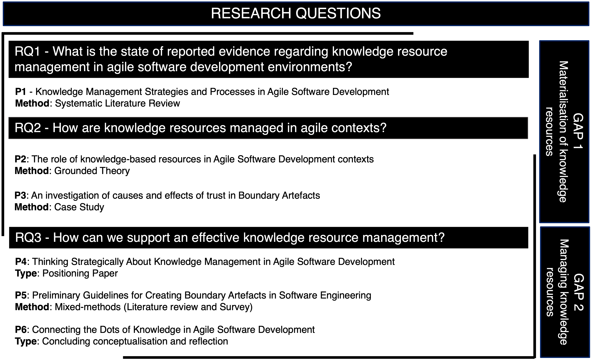

**Context**: Many software companies adopt Agile Software Development (ASD) principles through various methods, aiming to respond rapidly to the changes. Agile principles prioritise informal communication between their members and down-prioritise documentation to bring more flexibility and readiness when welcoming changes, posing pressure on how knowledge, a strategic resource, is shared and applied. In these contexts, many of these knowledge resources remain intangible, which poses challenges to resource management because knowledge is difficult to reproduce and manage, requiring lots of effort to understand what should remain tacit and what should be captured into artefacts. 

**Objective**: This thesis aims to contribute to materialising knowledge resources in agile software project environments and provide guidance on effectively managing them.

**Method**: We follow mostly the qualitative paradigm to investigate knowledge resource management. We adhere to social constructivism research, which notes that social phenomena undergo constant changes and are affected by human interaction. As qualitative and quantitative methods of investigation, we utilised literature reviews, grounded theory, survey and a case study.

**Results**: This thesis provides an empirical understanding of knowledge resources. We synthesised evidence from the literature to show the proportions of knowledge management practices utilised in ASD environments and the knowledge process they focus on. Through a grounded theory study, we identified Knowledge-based Resources (KBRs) that support changes in agile environments in the Knowledge-push theory. In this same study, we identified inefficiencies in converting KBRs into Property-based Resources (PBRs). This evidence led us to a case study in which we investigated the causes and effects of trust in Boundary Artefacts (BAs). The results have contributed to understanding the favourable factors that make stakeholders feel confident in utilising BAs and also pointed to the implication of decreased trust in software projects. Such negative implications can be mitigated by applying our developed and validated guideline that supports the creation of BAs in software engineering, which was perceived as being able to increase the trustworthiness of BAs.  

**Conclusions**: We clarify the concept of KBRs, identify them, and explain how they support changes in agile contexts. In this process, we uncover the inefficiencies in converting KBRs into PBRs. We also provide guidance on effectively managing knowledge resources in software project environments, which can be helpful for software organisations. For example, (i) understanding how trust aspects such as reliability, predictability, and functionality affect practitioners' confidence in BAs, (ii) providing a structured guideline that helps practitioners create BAs, (iii) incorporating more formal practices to manage BAs that do not necessarily abandon agile flexibility to deal with changes. 

# Research Questions and Papers

# Papers

**P1** - **Raquel** **Ouriques**, Krzysztof Wnuk, Tony Gorschek, and Richard Berntsson Svensson. "Knowledge Management Strategies and Processes in Agile Software Development: A Systematic Literature Review"  *International Journal of Software Engineering and Knowledge Engineering*, 29(3): 345–380, (2019). <https://doi.org/10.1142/S0218194019500153>
<form method="get" action="pdfs/p1_slr.pdf">
   <button type="submit">PDF</button>
</form>

**P2** - **Raquel** **Ouriques**, Krzysztof Wnuk, Tony Gorschek, and Richard Berntsson Svensson. "The role of knowledge-based resources in Agile Software Development contexts" *Journal of Systems and Software*, 197, 111572, (2023). <https://doi.org/10.1016/j.jss.2022.111572> 
<form method="get" action="pdfs/p2_kbr.pdf">
   <button type="submit">PDF</button>
</form>

**P3** - **Raquel** **Ouriques**, Fabian Fagerholm, Daniel Mendez, and Baldvin G. Bern. "An investigation of causes and effects of trust in Boundary Artefacts". *Information and Software Technology Journal*, 158, 107170, (2023). <https://doi.org/10.1016/j.infsof.2023.107170>
<form method="get" action="pdfs/p3_trust.pdf">
   <button type="submit">PDF</button>
</form>

**P4** - **Raquel** **Ouriques**, Krzysztof Wnuk, Richard Berntsson-Svensson and Tony Gorschek. "Thinking Strategically About Knowledge Management in Agile Software Development." *In Kuhrmann M. et al. (eds) Product-Focused Software Process Improvement. PROFES 2018. Lecture Notes in Computer Science*, LNCS 11271, 389–395, (2018). <https://doi.org/10.1007/978-3-030-03673-7_30>
<form method="get" action="pdfs/p4_profes.pdf">
   <button type="submit">PDF</button>
</form>

**P5** - **Raquel** **Ouriques**, Fabian Fagerholm, Daniel Mendez, Tony Gorschek, and Baldvin G. Bern. "Preliminary Guideline for Creating Boundary Artefacts in Software Engineering". *Submitted to Information and Software Technology Journal (Under review)*, IEEE, (2023). <https://doi.org/10.48550/arXiv.2306.05755>
<form method="get" action="pdfs/p5_guideline.pdf">
   <button type="submit">PDF</button>
</form>

**P6** - **Raquel** **Ouriques**, Tony Gorschek, Daniel Mendez, Fabian Fagerholm. "Connecting the Dots of Knowledge in Agile Software Development". *Submitted to IEEE Software Magazine (Under review)*, IEEE Software, (2023). <https://doi.org/10.48550/arXiv.2306.05742>
<form method="get" action="pdfs/p6_ieee.pdf">
   <button type="submit">PDF</button>
</form>

# Draft of the thesis

**Managing Knowledge Resources in Agile Software Development**
<form method="get" action="pdfs/Thesis.pdf">
   <button type="submit">PDF</button>
</form>

